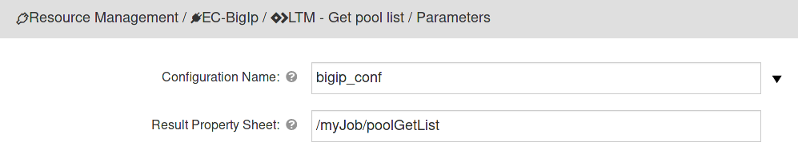

F5 Big-IP Networks provides a load balancer that is a device that acts
as a reverse proxy and distributes network or application traffic across
a number of servers. Load balancers are used to increase capacity
(concurrent users) and reliability of applications.

This plugin provides integration with F5 Big IP Load balancer through
its API.

# Building the plugin

1.  Download or clone the EC-BigIp repository.

        ```
        git clone https://github.com/electric-cloud-community/EC-BigIp.git
        ```

2.  Zip up the files to create the plugin zip file.

        ```
         cd EC-BigIp
         zip -r EC-BigIp.zip ./*
        ```

3.  Import the plugin zip file into your CloudBees CD/RO server and promote it.

## Plugin configurations

Plugin configurations are sets of parameters that can be applied across
some, or all, of the plugin procedures. They can reduce the repetition
of common values, create predefined parameter sets, and securely store
credentials. Each configuration is given a unique name that is entered
in the designated parameter for the plugin procedures that use them.

### Creating plugin configurations

To create plugin configurations in CloudBees CD/RO, complete the
following steps:

1.  Navigate to DevOps Essentials &gt; Plugin Management &gt; Plugin
    configurations.

2.  Select **Add plugin configuration** to create a new configuration.

3.  In the **New Configuration** window, specify a **Name** for the
    configuration.

4.  Select the **Project** that the configuration belongs to.

5.  Optionally, add a **Description** for the configuration.

6.  Select the appropriate **Plugin** for the configuration.

7.  Configure the parameters per the descriptions below.

You may need to create additional configurations later.

Configuration Parameters

<table>
<colgroup>
<col style="width: 50%" />
<col style="width: 50%" />
</colgroup>
<thead>
<tr class="header">
<th style="text-align: left;">Parameter</th>
<th style="text-align: left;">Description</th>
</tr>
</thead>
<tbody>
<tr class="odd">
<td style="text-align: left;"><p>Configuration Name</p></td>
<td style="text-align: left;"><p>The name for the created
configuration.</p></td>
</tr>
<tr class="even">
<td style="text-align: left;"><p>Description</p></td>
<td style="text-align: left;"><p>Description for the
configuration.</p></td>
</tr>
<tr class="odd">
<td style="text-align: left;"><p>Protocol</p></td>
<td style="text-align: left;"><p>Specifies whether to prefix hostname
with https:// or leave http://</p></td>
</tr>
<tr class="even">
<td style="text-align: left;"><p>Host</p></td>
<td style="text-align: left;"><p>Host name of the iControlREST API
instance.</p></td>
</tr>
<tr class="odd">
<td style="text-align: left;"><p>URL Path to API</p></td>
<td style="text-align: left;"><p>URL Base Path to iControlREST (if any)
that needs to be added to
<code>&lt;protocol&gt;://&lt;host&gt;:&lt;port&gt;</code> in order to
resolve the endpoint.</p>
<p>For example if the URL path to iControlREST is
<code>+http://myhost:2000/f5+</code> enter <code>/f5</code> and if the
URL path to iControlREST is <code>+http://myhost:2000+</code> leave this
field blank.</p></td>
</tr>
<tr class="even">
<td style="text-align: left;"><p>API server port</p></td>
<td style="text-align: left;"><p>Server port for example 443</p></td>
</tr>
<tr class="odd">
<td style="text-align: left;"><p>Type Of Authentication</p></td>
<td style="text-align: left;"><p>Specifies how a particular consumer is
authenticated to the system.</p>
<ul>
<li><p>HTTP BASIC Authentication</p></li>
<li><p>Token Based Authentication</p></li>
</ul></td>
</tr>
<tr class="even">
<td style="text-align: left;"><p>BigIp API Credentials</p></td>
<td style="text-align: left;"><p>Enter credentials required to perform
basic authentication.</p></td>
</tr>
<tr class="odd">
<td style="text-align: left;"><p>Authentication Provider</p></td>
<td style="text-align: left;"><p>The identifier of the internal or
external authentication provider: local, tmos.</p>
<p>Depends on Token Based Authentication.</p></td>
</tr>
<tr class="even">
<td style="text-align: left;"><p>Check Connection?</p></td>
<td style="text-align: left;"><p>If checked, the configuration will be
saved only if the test request with given credentials succeeds.</p></td>
</tr>
<tr class="odd">
<td style="text-align: left;"><p>Debug Level</p></td>
<td style="text-align: left;"><p>This option sets debug level for logs.
If info is selected, only summary information will be shown, for debug,
there will be some debug information and for trace the whole requests
and responses will be shown.</p></td>
</tr>
</tbody>
</table>

## Configuration form


# Plugin procedures

## LTM - config sync

Synchronizes the local BIG-IP device to the device group

### LTM - config sync parameters

<table>
<colgroup>
<col style="width: 50%" />
<col style="width: 50%" />
</colgroup>
<thead>
<tr class="header">
<th style="text-align: left;">Parameter</th>
<th style="text-align: left;">Description</th>
</tr>
</thead>
<tbody>
<tr class="odd">
<td style="text-align: left;"><p>Configuration Name</p></td>
<td style="text-align: left;"><p>Previously defined plugin
configuration.</p></td>
</tr>
<tr class="even">
<td style="text-align: left;"><p>Device Group Name</p></td>
<td style="text-align: left;"><p>Name of the Sync-Failover or Sync-Only
device group</p></td>
</tr>
<tr class="odd">
<td style="text-align: left;"><p>Result Property Sheet</p></td>
<td style="text-align: left;"><p>Results will be saved into this
property/property sheet</p></td>
</tr>
</tbody>
</table>

### Form sample


## LTM - create or update balancing pool

Create or update balancing pool configuration

### LTM - create or update balancing pool parameters

<table>
<colgroup>
<col style="width: 50%" />
<col style="width: 50%" />
</colgroup>
<thead>
<tr class="header">
<th style="text-align: left;">Parameter</th>
<th style="text-align: left;">Description</th>
</tr>
</thead>
<tbody>
<tr class="odd">
<td style="text-align: left;"><p>Configuration Name</p></td>
<td style="text-align: left;"><p>Previously defined plugin
configuration.</p></td>
</tr>
<tr class="even">
<td style="text-align: left;"><p>Update Action</p></td>
<td style="text-align: left;"><p>This parameter controls the update of a
balancing pool if one with the same name exists already:</p>
<ul>
<li><p><strong><code>Do Nothing</code></strong>
<em>(Default)</em> — Take no action, return silently.</p></li>
<li><p><strong><code>Remove and Create</code></strong> — Remove existing
balancing pool and Create a new one.</p></li>
<li><p><strong><code>Selective Update</code></strong> — Update existing
balancing pool for only parameters which have changed.</p></li>
<li><p><strong><code>Throw exception</code></strong> — Do not update.
Throw an error.</p></li>
</ul></td>
</tr>
<tr class="odd">
<td style="text-align: left;"><p>Partition Name</p></td>
<td style="text-align: left;"><p>Name of the partition.</p></td>
</tr>
<tr class="even">
<td style="text-align: left;"><p>Pool Name</p></td>
<td style="text-align: left;"><p>Name of the balancing pool.</p></td>
</tr>
<tr class="odd">
<td style="text-align: left;"><p>Optional Parameters</p></td>
<td style="text-align: left;"><p>Semicolon separated list of values in
the format <strong>parameter=value</strong> Available parameters:</p>
<ul>
<li><p>description - User defined description.</p></li>
<li><p>allowNat - Specifies whether the pool can load balance NAT
connections. The default value is yes.</p></li>
<li><p>allowSnat - Specifies whether the pool can load balance SNAT
connections. The default value is yes.</p></li>
<li><p>appService - The application service to which the object
belongs.</p></li>
<li><p>autoscaleGroupId - Autoscale-group ID to which pool members
belong to.</p></li>
<li><p>gatewayFailsafeDevice - Specifies that the pool is a gateway
failsafe pool in a redundant configuration. This string identifies the
device that will failover when the monitor reports the pool member down.
By default the device string is empty.</p></li>
<li><p>ignorePersistedWeight - Do not count the weight of persisted
connections on pool members when making load balancing
decisions.</p></li>
<li><p>ipTosToClient - Specifies the Type of Service (ToS) level to use
when sending packets to a client. 65534 (mimic) specifies that the
system sets the ToS level of outgoing packets to the same ToS level of
the most-recently received incoming packet. The default value is 65535
(pass-through).</p></li>
<li><p>ipTosToServer - Specifies the Type of Service (ToS) level to use
when sending packets to a server. 65534 (mimic) specifies that the
system sets the ToS level of outgoing packets to the same ToS level of
the most-recently received incoming packet. The default value is 65535
(pass-through).</p></li>
<li><p>linkQosToClient - Specifies the Quality of Service (QoS) level to
use when sending packets to a client. The default value is 65535
(pass-through).</p></li>
<li><p>linkQosToServer - Specifies the Quality of Service (QoS) level to
use when sending packets to a server. The default value is 65535
(pass-through).</p></li>
<li><p>loadBalancingMode - Specifies the modes that the system uses to
load balance name resolution requests among the members of this pool.
See "help pool" for a description of each loading balancing
mode.</p></li>
<li><p>minActiveMembers - Specifies the minimum number of members that
must be up for traffic to be confined to a priority group when using
priority-based activation. The default value is 0 (zero). An active
member is a member that is up (not marked down) and is handling fewer
connections than its connection limit.</p></li>
<li><p>minUpMembers - Specifies the minimum number of pool members that
must be up; otherwise, the system takes the action specified in the
min-up-members-action option. Use this option for gateway pools in a
redundant system where a unit number is applied to a pool. This
indicates that the pool is only configured on the specified
unit.</p></li>
<li><p>minUpMembersAction - Specifies the action to take if the
min-up-members-checking is enabled and the number of active pool members
falls below the number specified in min-up-members. The default value is
failover.</p></li>
<li><p>minUpMembersChecking - Enables or disables the min-up-members
feature. If you enable this feature, you must also specify a value for
both the min-up-members and min-up-members-action options.</p></li>
<li><p>monitor - Specifies the health monitors that the system uses to
determine whether it can use this pool for load balancing. The monitor
marks the pool up or down based on whether the monitor(s) are
successful. You can specify a single monitor, multiple monitors "http
and https", or a "min" rule, "min 1 of \{ http https }". You may remove
the monitor by specifying "none".</p></li>
<li><p>tmPartition - Displays the administrative partition within which
the pool resides.</p></li>
<li><p>queueDepthLimit - Specifies the maximum number of connections
that may simultaneously be queued to go to any member of this pool. The
default is zero which indicates there is no limit.</p></li>
<li><p>queueOnConnectionLimit - Enable or disable queuing connections
when pool member or node connection limits are reached. When queuing is
not enabled, new connections are reset when connection limits are
met.</p></li>
<li><p>queueTimeLimit - Specifies the maximum time, in milliseconds, a
connection will remain enqueued. The default is zero which indicates
there is no limit.</p></li>
<li><p>reselectTries - Specifies the number of times the system tries to
contact a pool member after a passive failure. A passive failure
consists of a server-connect failure or a failure to receive a data
response within a user-specified interval. The default is 0 (zero),
which indicates no reselect attempts.</p></li>
<li><p>serviceDownAction - Specifies the action to take if the service
specified in the pool is marked down. The default value is
none.</p></li>
<li><p>slowRampTime - Specifies, in seconds, the ramp time for the pool.
This provides the ability to cause a pool member that has just been
enabled, or marked up, to receive proportionally less traffic than other
members in the pool. The proportion of traffic the member accepts is
determined by how long the member has been up in comparison to the
slow-ramp-time setting for the pool. For example, if the
load-balancing-mode of a pool is round-robin, and it has a
slow-ramp-time of 60 seconds, when a pool member has been up for only 30
seconds, the pool member receives approximately half the amount of new
traffic as other pool members that have been up for more than 60
seconds. After the pool member has been up for 45 seconds, it receives
approximately three quarters of the new traffic. The slow ramp time is
particularly useful when used with the least-connections-member load
balancing mode. The default value is 10.</p></li>
<li><p>trafficAccelerationStatus - Not described in the official
documentation. Please consult: <a href="https://support.f5.com/">F5
Support</a></p></li>
</ul></td>
</tr>
<tr class="even">
<td style="text-align: left;"><p>Result Property Sheet</p></td>
<td style="text-align: left;"><p>Results will be saved into this
property/property sheet.</p></td>
</tr>
</tbody>
</table>

#### Form Sample


## LTM - get pool list

Get balancing pool list

### LTM - get pool list parameters

<table>
<colgroup>
<col style="width: 50%" />
<col style="width: 50%" />
</colgroup>
<thead>
<tr class="header">
<th style="text-align: left;">Parameter</th>
<th style="text-align: left;">Description</th>
</tr>
</thead>
<tbody>
<tr class="odd">
<td style="text-align: left;"><p>Configuration Name</p></td>
<td style="text-align: left;"><p>Previously defined plugin
configuration.</p></td>
</tr>
<tr class="even">
<td style="text-align: left;"><p>Result Property Sheet</p></td>
<td style="text-align: left;"><p>Results will be saved into this
property/property sheet.</p></td>
</tr>
</tbody>
</table>

#### Form Sample



## LTM - get balancing pool

Get pool configuration

### LTM - get balancing pool parameters

<table>
<colgroup>
<col style="width: 50%" />
<col style="width: 50%" />
</colgroup>
<thead>
<tr class="header">
<th style="text-align: left;">Parameter</th>
<th style="text-align: left;">Description</th>
</tr>
</thead>
<tbody>
<tr class="odd">
<td style="text-align: left;"><p>Configuration Name</p></td>
<td style="text-align: left;"><p>Previously defined plugin
configuration.</p></td>
</tr>
<tr class="even">
<td style="text-align: left;"><p>Partition Name</p></td>
<td style="text-align: left;"><p>Name of the partition.</p></td>
</tr>
<tr class="odd">
<td style="text-align: left;"><p>Pool Name</p></td>
<td style="text-align: left;"><p>Name of the balancing pool.</p></td>
</tr>
<tr class="even">
<td style="text-align: left;"><p>Result Property Sheet</p></td>
<td style="text-align: left;"><p>Results will be saved into this
property/property sheet.</p></td>
</tr>
</tbody>
</table>

#### Form Sample


## LTM - delete balancing pool

Delete balancing pool configuration

### LTM - delete balancing pool parameters

<table>
<colgroup>
<col style="width: 50%" />
<col style="width: 50%" />
</colgroup>
<thead>
<tr class="header">
<th style="text-align: left;">Parameter</th>
<th style="text-align: left;">Description</th>
</tr>
</thead>
<tbody>
<tr class="odd">
<td style="text-align: left;"><p>Configuration Name</p></td>
<td style="text-align: left;"><p>Previously defined plugin
configuration.</p></td>
</tr>
<tr class="even">
<td style="text-align: left;"><p>Partition Name</p></td>
<td style="text-align: left;"><p>Name of the partition.</p></td>
</tr>
<tr class="odd">
<td style="text-align: left;"><p>Pool Name</p></td>
<td style="text-align: left;"><p>Name of the balancing pool.</p></td>
</tr>
<tr class="even">
<td style="text-align: left;"><p>Result Property Sheet</p></td>
<td style="text-align: left;"><p>Results will be saved into this
property/property sheet.</p></td>
</tr>
</tbody>
</table>

#### Form Sample


## Pool member operations

### LTM - create or update pool member

Create the set of pool members that are associated with a load balancing
pool

### LTM - create or update pool member parameters

<table>
<colgroup>
<col style="width: 50%" />
<col style="width: 50%" />
</colgroup>
<thead>
<tr class="header">
<th style="text-align: left;">Parameter</th>
<th style="text-align: left;">Description</th>
</tr>
</thead>
<tbody>
<tr class="odd">
<td style="text-align: left;"><p>Configuration Name</p></td>
<td style="text-align: left;"><p>Previously defined plugin
configuration.</p></td>
</tr>
<tr class="even">
<td style="text-align: left;"><p>Update Action</p></td>
<td style="text-align: left;"><p>This parameter controls the update of a
balancing pool member if one with the same name exists already:</p>
<ul>
<li><p><strong><code>Do Nothing</code></strong>
<em>(Default)</em> — Take no action, return silently.</p></li>
<li><p><strong><code>Remove and Create</code></strong> — Remove existing
balancing pool member and Create a new one.</p></li>
<li><p><strong><code>Selective Update</code></strong> — Update existing
balancing pool member for only parameters which have changed.</p></li>
<li><p><strong><code>Throw exception</code></strong> — Do not update.
Throw an error.</p></li>
</ul></td>
</tr>
<tr class="odd">
<td style="text-align: left;"><p>Partition Name</p></td>
<td style="text-align: left;"><p>Name of the partition.</p></td>
</tr>
<tr class="even">
<td style="text-align: left;"><p>Pool Name</p></td>
<td style="text-align: left;"><p>Name of the balancing pool.</p></td>
</tr>
<tr class="odd">
<td style="text-align: left;"><p>Member Name</p></td>
<td style="text-align: left;"><p>A name for this member.</p></td>
</tr>
<tr class="even">
<td style="text-align: left;"><p>Optional Parameters</p></td>
<td style="text-align: left;"><p>Semicolon separated list of values in
the format <strong>parameter=value</strong> Available parameters:</p>
<ul>
<li><p>description - User defined description.</p></li>
<li><p>address - IP address of a pool member if a node by the given name
does not already exist.</p></li>
<li><p>appService - The application service to which the object
belongs.</p></li>
<li><p>connectionLimit - Specifies the maximum number of concurrent
connections allowed for a pool member. The default value is 0
(zero).</p></li>
<li><p>dynamicRatio - Specifies a range of numbers that you want the
system to use in conjunction with the ratio load balancing method. The
default value is 1.</p></li>
<li><p>ephemeral - Specifies if member is ephemeral.</p></li>
<li><p>inheritProfile - Specifies whether the pool member inherits the
encapsulation profile from the parent pool. The default value is
enabled. If you disable inheritance, no encapsulation takes place,
unless you specify another encapsulation profile for the pool member
using the profiles attribute.</p></li>
<li><p>logging - Specifies whether the pool member’s monitor(s) actions
will be logged. Logs are stored in /var/log/monitors/.</p></li>
<li><p>monitor - Displays the health monitors that are configured to
monitor the pool member, and the status of each monitor. The default
value is default.</p></li>
<li><p>priorityGroup - Specifies the priority group within the pool for
this pool member. The priority group number specifies that traffic is
directed to that member before being directed to a member of a lower
priority. The default value is 0.</p></li>
<li><p>rateLimit - Specifies the maximum number of connections per
second allowed for a pool member.</p></li>
<li><p>ratio - Specifies the ratio weight that you want to assign to the
pool member. The default value is 1.</p></li>
<li><p>session - Enables or disables the pool member for new sessions.
The default value is user-enabled.</p></li>
<li><p>state - user-down forces the pool member offline, overriding
monitors. user-up reverts the user-down. When user-up, this displays the
monitor state.</p></li>
<li><p>trafficAccelerationStatus - Not described in the official
documentation. Please consult: F5 Support</p></li>
</ul></td>
</tr>
<tr class="odd">
<td style="text-align: left;"><p>Result Property Sheet</p></td>
<td style="text-align: left;"><p>Results will be saved into this
property/property sheet.</p></td>
</tr>
</tbody>
</table>

#### Form Sample


## LTM - change pool member status

Change pool member status

### LTM - change pool member status parameters

<table>
<colgroup>
<col style="width: 50%" />
<col style="width: 50%" />
</colgroup>
<thead>
<tr class="header">
<th style="text-align: left;">Parameter</th>
<th style="text-align: left;">Description</th>
</tr>
</thead>
<tbody>
<tr class="odd">
<td style="text-align: left;"><p>Configuration Name</p></td>
<td style="text-align: left;"><p>Previously defined plugin
configuration.</p></td>
</tr>
<tr class="even">
<td style="text-align: left;"><p>Partition Name</p></td>
<td style="text-align: left;"><p>Name of the partition.</p></td>
</tr>
<tr class="odd">
<td style="text-align: left;"><p>Pool Name</p></td>
<td style="text-align: left;"><p>Name of the balancing pool.</p></td>
</tr>
<tr class="even">
<td style="text-align: left;"><p>Member Name</p></td>
<td style="text-align: left;"><p>Name of the member.</p></td>
</tr>
<tr class="odd">
<td style="text-align: left;"><p>Status</p></td>
<td style="text-align: left;"><p>Desired status of the pool member:</p>
<ul>
<li><p>Enabled (All traffic allowed)</p></li>
<li><p>Disabled (Only persistent or active connections allowed)</p></li>
<li><p>Forced Offline (Only active connections allowed)</p></li>
</ul>
<p>Details:</p>
<ul>
<li><p><a href="https://devcentral.f5.com/articles/icontrol-rest-working-with-pool-members">iControl
REST: Working with Pool Members</a></p></li>
<li><p><a href="https://support.f5.com/csp/article/K13310">K13310:
Disabling nodes or pool members for maintenance (11.x -
14.x)</a></p></li>
</ul></td>
</tr>
<tr class="even">
<td style="text-align: left;"><p>Result Property Sheet</p></td>
<td style="text-align: left;"><p>Results will be saved into this
property/property sheet.</p></td>
</tr>
</tbody>
</table>

#### Form Sample


## LTM - get member list

Get all pool members that make up a load balancing pool

### LTM - get member list parameters

<table>
<colgroup>
<col style="width: 50%" />
<col style="width: 50%" />
</colgroup>
<thead>
<tr class="header">
<th style="text-align: left;">Parameter</th>
<th style="text-align: left;">Description</th>
</tr>
</thead>
<tbody>
<tr class="odd">
<td style="text-align: left;"><p>Configuration Name</p></td>
<td style="text-align: left;"><p>Previously defined plugin
configuration.</p></td>
</tr>
<tr class="even">
<td style="text-align: left;"><p>Partition Name</p></td>
<td style="text-align: left;"><p>Name of the partition.</p></td>
</tr>
<tr class="odd">
<td style="text-align: left;"><p>Pool Name</p></td>
<td style="text-align: left;"><p>Name of the balancing pool.</p></td>
</tr>
<tr class="even">
<td style="text-align: left;"><p>Result Property Sheet</p></td>
<td style="text-align: left;"><p>Results will be saved into this
property/property sheet.</p></td>
</tr>
</tbody>
</table>

#### Form Sample


## LTM - get pool member

Get a specified pool member from a load balancing pool

### LTM - get pool member parameters

<table>
<colgroup>
<col style="width: 50%" />
<col style="width: 50%" />
</colgroup>
<thead>
<tr class="header">
<th style="text-align: left;">Parameter</th>
<th style="text-align: left;">Description</th>
</tr>
</thead>
<tbody>
<tr class="odd">
<td style="text-align: left;"><p>Configuration Name</p></td>
<td style="text-align: left;"><p>Previously defined plugin
configuration.</p></td>
</tr>
<tr class="even">
<td style="text-align: left;"><p>Partition Name</p></td>
<td style="text-align: left;"><p>Name of the partition.</p></td>
</tr>
<tr class="odd">
<td style="text-align: left;"><p>Pool Name</p></td>
<td style="text-align: left;"><p>Name of the balancing pool.</p></td>
</tr>
<tr class="even">
<td style="text-align: left;"><p>Member Name</p></td>
<td style="text-align: left;"><p>A name for this member.</p></td>
</tr>
<tr class="odd">
<td style="text-align: left;"><p>Result Property Sheet</p></td>
<td style="text-align: left;"><p>Results will be saved into this
property/property sheet.</p></td>
</tr>
</tbody>
</table>

#### Form Sample


## LTM - delete pool member

Delete a specified pool member from a load balancing pool

### LTM - delete pool member parameters

<table>
<colgroup>
<col style="width: 50%" />
<col style="width: 50%" />
</colgroup>
<thead>
<tr class="header">
<th style="text-align: left;">Parameter</th>
<th style="text-align: left;">Description</th>
</tr>
</thead>
<tbody>
<tr class="odd">
<td style="text-align: left;"><p>Configuration Name</p></td>
<td style="text-align: left;"><p>Previously defined plugin
configuration.</p></td>
</tr>
<tr class="even">
<td style="text-align: left;"><p>Partition Name</p></td>
<td style="text-align: left;"><p>Name of the partition.</p></td>
</tr>
<tr class="odd">
<td style="text-align: left;"><p>Pool Name</p></td>
<td style="text-align: left;"><p>Name of the balancing pool.</p></td>
</tr>
<tr class="even">
<td style="text-align: left;"><p>Member Name</p></td>
<td style="text-align: left;"><p>A name for this member.</p></td>
</tr>
<tr class="odd">
<td style="text-align: left;"><p>Result Property Sheet</p></td>
<td style="text-align: left;"><p>Results will be saved into this
property/property sheet.</p></td>
</tr>
</tbody>
</table>

#### Form Sample


# Release notes

## EC-BigIp 3.1.2

Authentication token is renewed after the step is finished.

## EC-BigIp 3.1.1

Improved error details in case of failure

## EC-BigIp 3.1.0

Add checking connection while creating/editing a configuration

Add Token Based Authentication

## EC-BigIp 3.0.1

Renaming to "CloudBees"

Remove excessive information from help

## EC-BigIp 3.0.0

Procedure Interfaces in this version of the Plugin have been changed for
Usability and Robustness. If a previous major version (i.e., version ⇐
2.X) of this plugin exists in your environment, this version of the
plugin will not promote, until you demote the previous major version.
This approach is taken in order to provide you with an opportunity to
understand refactoring impacts upon upgrade. Please make sure you
understand the impact before upgrading to this version of the plugin.
The following is the list of key changes made to this plugin.

-   New procedure **LTM - Config sync**.

-   New Field Update Action added to **LTM - Create or update balancing
    pool** to control update behavior.

-   New Field Update Action added to **LTM - Create or update pool
    member** to control update behavior.

-   Existing procedure **LTM - Manage balancing pool removed**.

-   Existing procedure **LTM - Manage pool member removed**.

## EC-BigIp 2.0.2

-   The plugin icon has been updated.

## EC-BigIp 2.0.1

-   Documentation cleanup.

## EC-BigIp 2.0.0

-   Plugin revision.

## EC-BigIp 1.0.2

-   Added new parameter *Path to BigIp* for all procedures.

## EC-BigIp 1.0.1

-   Fixed the step picker for procedure "Add Members to Pool"

## EC-BigIp 1.0.0

-   4.1 XML parameter panels ready.

-   4.1 help page format ready.
